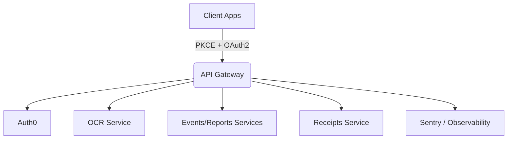

# BPOE API Gateway Documentation

Welcome to the knowledge base for the Be Part of the Event (BPOE) API Gateway.
This site is aimed at developers and operators who need to understand how the gateway orchestrates Auth0 authentication, forwards traffic to microservices, and how to extend or observe it safely.

## What is inside?

!!! info "Documentation structure"
    - **Overview (you are here)** – project summary, environment requirements, and onboarding workflows.
    - **API Reference** – auto-generated docs for FastAPI routers, updated straight from the code via `mkdocstrings`.
    - **Guides (coming soon)** – recipes for running the gateway in development, staging, and production contexts, plus CI/CD tips.

## Architecture in a nutshell



- **FastAPI + Auth0**: the gateway handles browser/mobile Auth0 flows (PKCE, state, session storage) and exposes microservice-facing endpoints.
- **Observability**: Sentry is wired in via environment variables; tracing and profiling can be toggled per environment.
- **Security guardrails**: configurable CORS allow-list, strict session secrets, and token redaction in logs.

## Getting started

1. Install project dependencies (including documentation toolchain):
   ```bash
   poetry install --with dev
   ```
2. Copy configuration template and provide credentials:
   ```bash
   cp docker/.env.template docker/.env
   # fill in Auth0, CORS, Sentry, session secrets
   ```
3. Run the API Gateway locally:
   ```bash
   poetry run uvicorn src.main:app --host 0.0.0.0 --port 8080 --reload
   ```
4. Serve documentation alongside the app:
   ```bash
   poetry run mkdocs serve
   ```

## Deployment checklist

- [ ] Environment variables set via secret manager (Auth0, Sentry, APP_SECRET_KEY).
- [ ] MkDocs built via `poetry run mkdocs build` and published with release artifacts.
- [ ] API Gateway image built and pushed via CI (Docker Compose/Helm manifests updated).
- [ ] Monitoring dashboards updated with new endpoints or SLOs.
- [ ] Security review checklist completed (CORS origins, session key rotation, PKCE validation).
